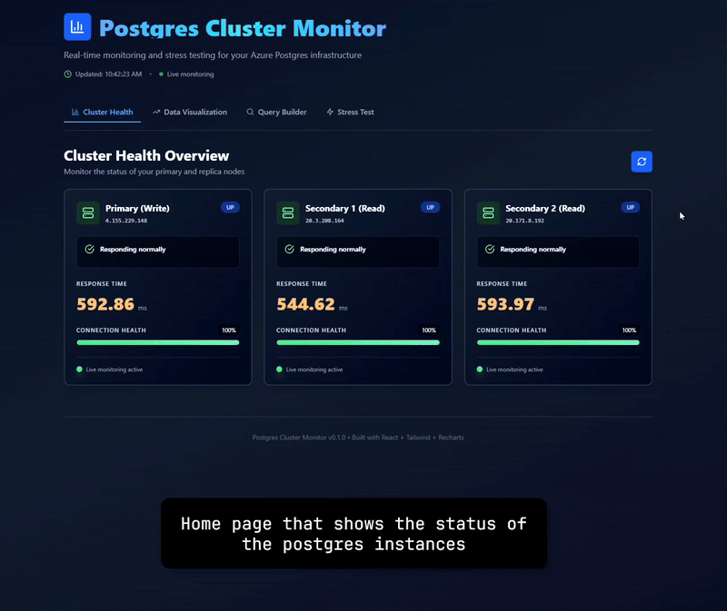

# Postgres Cluster Monitor

High-availability Postgres monitoring and visualization — with connection pooling (pgBouncer), async APIs (FastAPI + asyncpg), a modern React dashboard, and built-in load testing (Locust).

This project targets a self-managed Postgres cluster deployed on Azure VMs (not Azure Database for PostgreSQL). It simulates a production-like stack for read/write routing and real-time health checks against a remote Postgres cluster (primary + read replicas), showcasing practical systems skills: networking on cloud VMs, pooling, failover-aware reads, async services, and data visualization.

## Demo



## Architecture

```
						 ┌───────────────────┐
						 │  React Frontend   │
						 └─────────┬─────────┘
								   │ proxy /health, /data
								   ▼
						 ┌──────────────────┐
						 │  FastAPI Backend │  Async I/O (8000)
						 └─────────┬────────┘
								   │ via PGBOUNCER_HOST:PGBOUNCER_PORT
								   ▼
						 ┌──────────────────┐
						 │    pgBouncer     │  Pools + routes
						 └─────────┬────────┘
								   │
                                   |
                            Azure VNet Boundary
                          (Self-managed Postgres)
                                   |
                                   ▼
  ┌────────────────────────────────┬─────────────────────────────────────────────────────────────────┐
  |   Azure Cloud                  |                                                                 |
  |					   ┌───────────┴─────────────┬──────────────────────────────────┐                |
  |					   │                         │                                  |                |
  |					   │                         │                                  |                |
  |					   │                         │                                  |                |
  | ┌──────────────────┴────────────┐  ┌─────────┴──────────────────┐  ┌────────────┴─────────────┐  |
  | │  Azure VM: Primary (RW)       │  │  Azure VM: Read Replica    │  │  Azure VM: Read Replica  │  |
  | │  Postgres: bitcoin_write      │  │  Postgres: bitcoin_read_1  │  │  Postgres: bitcoin_read_2│  |
  | └───────────────────────────────┘  └────────────────────────────┘  └──────────────────────────┘  |
  └──────────────────────────────────────────────────────────────────────────────────────────────────┘

Locust (8089) drives traffic to the backend for test runs.

Notes:
- All database nodes run on Azure VMs self provision and manage (Ubuntu VMs), with Postgres installed and self configured.
- No managed PaaS is used; networking, firewall rules (NSGs), and TLS are handeled personally.
- Replication is self-managed (e.g., Postgres streaming replication) between the primary and read replicas.
```

## Tech Stack

**Backend**

[](https://www.python.org/)
[](https://fastapi.tiangolo.com/)
[](https://github.com/MagicStack/asyncpg)
[](https://www.uvicorn.org/)

**Database**

[](https://www.postgresql.org/)
[](https://www.pgbouncer.org/)

**Frontend**

[](https://react.dev/)
[](https://tailwindcss.com/)
[](https://recharts.org/en-US/)
[](https://locust.io/)

**Deployment**

[](https://docs.docker.com/compose/)
[](https://portal.azure.com/)


## Getting Started

### 1. Setup Distributed Postgres Cluster on Azure VMs

Before running the monitoring application, you need to set up a distributed Postgres cluster on Azure VMs.

**Detailed setup instructions are available in:** [`References_and_Setup.pdf`](References_and_Setup.pdf)

This includes:

- Creating Azure VMs (Ubuntu) for primary and read replica nodes
- Installing and configuring PostgreSQL on each VM
- Setting up streaming replication between primary and replicas
- Configuring network security groups (NSGs) and firewall rules
- Establishing secure connections and TLS

### 2. Configure Environment Variables

After setting up your Postgres cluster, create a `.env` file in the repo root with your cluster connection details:

```env
# Postgres hosts (Azure VM IPs or DNS names)
PRIMARY_HOST=<your-primary-vm-ip>
SECONDARY1_HOST=<your-replica1-vm-ip>
SECONDARY2_HOST=<your-replica2-vm-ip>

# Database authentication
DB_USER=postgres
DB_PASSWORD=<your-password>
DB_NAME=postgres

# pgBouncer configuration
PGBOUNCER_HOST=pgbouncer
PGBOUNCER_PORT=6432
```

Replace the placeholder values with your actual Azure VM addresses and credentials.

### 3. Run the Application

Prerequisites: Docker Desktop (Windows/macOS/Linux)

Build and start all services:

```powershell
docker compose up --build
```

Services will be available at:

- **Frontend Dashboard:** http://localhost:5173
- **Backend API (Health):** http://localhost:8000/health
- **Backend API (Data):** http://localhost:8000/data?limit=500
- **Load Testing (Locust):** http://localhost:8089
- **pgBouncer:** localhost:6432

---
